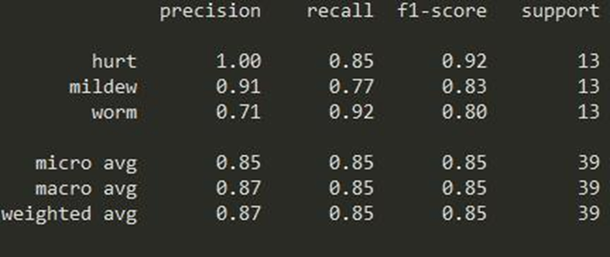

# Image-classification-Alexnet-Tensorflow
Image classification based on Alexnet-Tensorflow and SVM.
Please understand that original ECG images are removed because of privacy. For test images you could use corns images examples in https://github.com/QiyuanMa/Image-classification-SVM-ML
The models and codes are the same.

# Introduction
This project provides a image classification model based on Alexnet-tensorflow and compared it with SVM. 
The accuraty is 0.87, but you should adjust the parameters for your images.

# Usage
Run run.py, you should run train(), generate_pre_result(), evaluation_eval_dataset() individually. And evaluation_eval_dataset is only for result visualization.

# Parameters Adjustment

# Results(corns samples)
(1)The generated txt, which is for providing images locations for further steps.

(2)Ttraining models in checkpoint, please ba aware that the model selection should be effected by best_val_acc.
You should use the model which testing accuracy higher than best_val_acc.

(3)Training results(study rate is 0.0001)

(4)Model labels(run test_pred_labels)

# Visualization(corns samples)
Run evaluation_eval_dataset()
(1)The above 5 is correctly classified images,the below 5 is wrong classified images.

(2)The comparation of correct and wrong images.

(3)The SVM image classification final accuracy result

(4)The Alexnet image classification final accurary result

